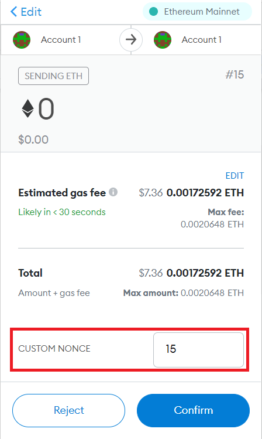

# Replaced Transactions

If the status is pending you can replace transaction with increased gas limit to have it mined quicker. To do it in just send another transactions with the same nonce as previous. This transaction is called `replaced transaction`.
After replacing transaction on wallet, you will see it as a previous transaction(one you replaced) and it will be treated as a previous transaction.

## UseDapp behaviour

UseDapp supports replaced transactions. After replacing the useDapp's transaction status will be shown as `Exception`, but after it is mined the status will be `Success`.
