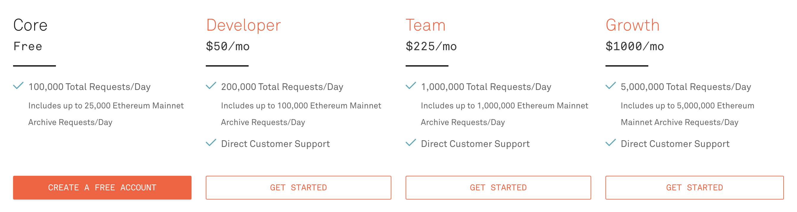

# What is a DApp

DApp stands for Decentralized APPlication. It is an application that can typically operate without the central server, typically through the use of smart contracts, that run on a decentralized computing, blockchain or other distributed ledger system. One of the most known DApps is [Uniswap](https://app.uniswap.org) - a decentralized exchange (DEX) that enables users to trade cryptocurrencies without any involvement with a centralized third part. It is built on top of the [Ethereum blockchain](https://ethereum.org).

In this tutorial, you will learn a lot of stuff about how decentralized applications work. But the most import thing you'll learn how to build one on your own! We'll have some smart contracts and will create a DApp that will interact with these smart contracts. The main goal of the tutorial is to get to know `useDApp` - a library with a collection of react hooks that helps you to interact with the EVM-based blockchains.

## Ethereum API

Blockchain nodes are accessible via network. There are several internet services that provide access to blockchain data without the need to access specific blockchain nodes. The examples include [Infura](https://infura.io/), [Alchemy](https://www.alchemy.com/).

## Ethereum basics

When calling an Ethereum node, we differentiate between two types of calls: read-only calls and write calls.

| Read-only calls | Write calls |
| --- | --- |
| Free [^1] | Have to pay gas fee |
| Can only read the state of blockchain | Can modify the state of blockchain |
| Doesn't need to be signed | Needs to be signed (for instance using a wallet) |

[^1]: Ethereum API provider (such as Infura or Alchemy) fees may apply. See [this blog post](https://medium.com/truefieng/whats-new-in-usedapp-1-1-49fdbdf912b5) to learn more about how useDApp minimizes API provider costs. 

## Blockchain state

### Mining blocks

In case of mainnet, a block is mined approximately every 15 seconds. That means that every 15 seconds the state changes and the values returned by smart contract methods might change. So in order to be able to keep the displayed data synced with the actual state of the blockchain, we need make calls pretty often (ideally each new block).
Typical DApp interacts with a lot of smart contracts. So, in order to keep the data synced, we need to make a lot of calls. And despite the read-only calls in Ethereum protocol are free, we still need some kind of external service like Infura or Alchemy. And both of those charge some money for the calls.

 <b> Pricing on Infura as of November 2022 </b> 

Not only do the frequent requests to an API provider spike up your bill, but it also slows down the app for the user.

## Summary

We've learned what is a DApp, and how it connects to the blockchain.

We now see that there is a potential problem with too many requests to API providers.

---

Now that we have explained the basics of DApps, let's dive into what would be the [requirements of a well functioning dApp](./DApp%20Requirements).
