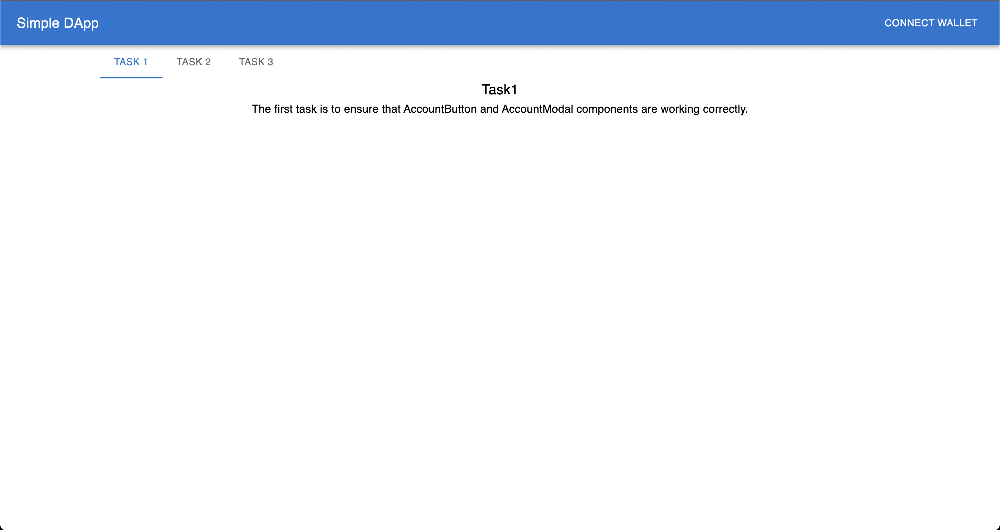

# Setup

Now we'll get some hands on experience on building simple DApp using useDApp! In order to complete the tutorial, you'll need:

- git
- node version 16 or higher
- yarn
- Metamask installed in your browser

The first step is to clone the repo that is prepared specififaclly for this tutorial.

```bash
git clone https://github.com/yivlad/useDApp-tutorial.git
```

Go to the repo root directory:

```bash
cd useDApp-tutorial
```

Install all dependecies:

```bash
yarn
```

The repo is a yarn workspaces monorepo. Under the `packages` directory you can find two directories:

- `contracts`. This is a directory with the package named `@simple-dapp/contracts`. It contains `Solidity` code for `WETH10` and all necessary stuff to deploy it to the local blockchain node. The package provides few commands that you may find useful:

  - `yarn start-ganache` - starts a local blockchain node on port `8545`.
  - `yarn deploy-local` - deploys the `WETH10` contract to the local blockchain node. The contract address will be printed to the console. The local blockchain node should be running.
  - `yarn get-funds` - you can pass in your address as a parameter and get 1 ETH on your account on the local node. The local blockchain node should be running.

  [Waffle](https://github.com/TrueFiEng/Waffle) is used here to compile, test and deploy the contracts. `WETH10` contract type and ABI are exported from the package.
- `frontend`. This is the package we'll make our changes during the tutorial. It's a `React` app configured to use `useDApp` and [ethers](https://docs.ethers.io/v5/). The app depends on the package `@simple-dapp/contracts` and uses `WETH10` contract type and ABI.

Let's build both packages:

```bash
yarn build
```

Next you'll need to have 3 terminal windows open.

- In the first one, run `yarn start-ganache` from the `packages/contracts` directory. This will start a local blockchain node on port `8545`.
- We'll use the second terminal window to interact with the local blockhain node via the CLI. Go to the `@simple-dapp/contracts` package.

```bash
cd packages/contracts
```

Let's first deploy the `WETH10` contract to the local blockhain node we started in the previous step.

```bash
yarn deploy-local
```

Next let's get some funds to be able to send transactions. First we need to get our address. Go to your brower and open Metamask. Copy your address. Then go back to the terminal window and run:

```bash
yarn get-funds INSERT_YOUR_ADDRESS_HERE
```

- In the third terminal window, go to the `packages/frontend` directory and run `yarn start`. This will start the `React` app on port `3000`.

Open `http://localhost:3000` in your browser. You should see the following page:


Now we're ready to start building our DApp!
