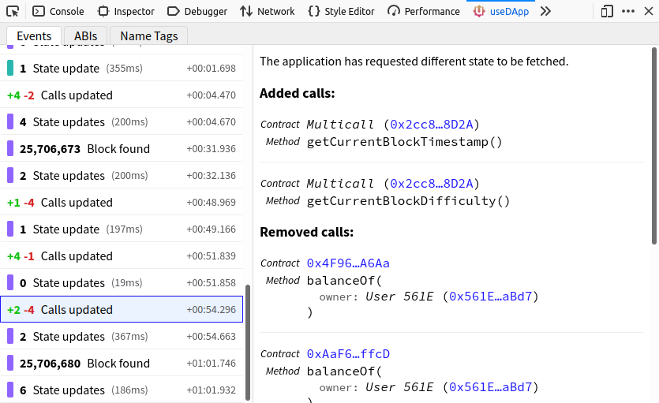
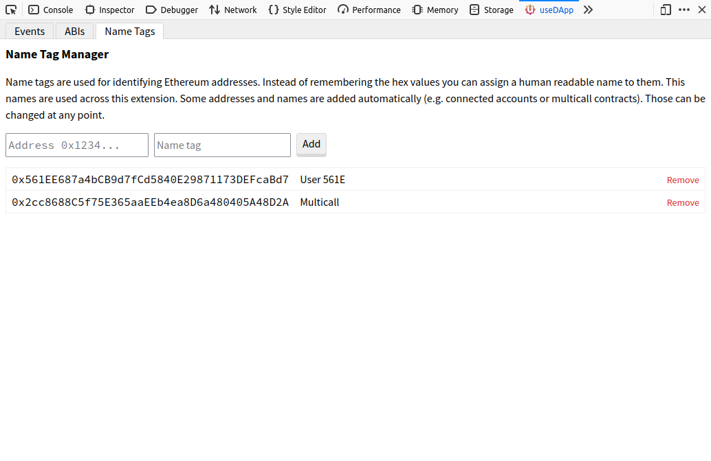

# Developer tools



## Installation

In order to use useDapp developer tools you can install it for your browser.

- Chrome Web Store
- Firefox Add-ons

Alternatively you can build it from source and manually install it.

1. Clone this repository and build the source

```bash
  git clone https://github.com/EthWorks/useDApp.git
  cd useDApp
  yarn && yarn build
```

2. If you are using the chrome browser:
  - Go to [chrome://extensions/](chrome://extensions/)
  - Toggle developer mode
  - Click load unpacked
  - Open `useDapp/packages/extension/build`

3. If you are using firefox:
  - Go to [about:debugging](about:debugging)
  - Click This Firefox
  - Click Load Temporary Add-on
  - Open `useDapp/packages/extension/build/manifest.json`

## List of events


### Init

 This is always the first event being displayed. It is fired when the useDapp library loads and contains a timestamp of that. All other events are timed relative to Init.

### Network connected / disconnected 

 When the network changes on the provider this event is fired. Each network has its own name and color and other events are color coded according to the network they happened on. Those colors are also the exact same that Metamask uses, so you will feel right at home.

### Account connected / disconnected 

 When the user connects an account or changes it this event gets fired. You will also see the first four digits of the address for easier visual grepping.

### Block found

useDapp is constantly listening for new blocks. It does this so that it can maintain up to date blockchain state.

### Calls updated

To understand the information that the extension presents it is necessary to understand how useDapp manages blockchain data. Whenever the app makes a call to a high level hook like ``useTokenBalance`` a low level ``useContractCalls`` is invoked. useDapp maintains a list of blockchain calls that will be made whenever a new block is found. 

``useContractCalls`` adds or removes calls from that list. Because making lots of blockchain calls at once is problematic the calls are actually aggregated together in one giant call to the [Multicall](https://github.com/makerdao/multicall) contract. The resulting data is later decoded and returned back to higher level hooks.

The developer tools extension decodes and displays all the calls so that it is trivial to tell what is going on. Whenever the call list is modified the Calls updated event is emitted and a detailed breakdown of changes is made available to the user. The calls displayed can be Added, Removed or Persisted.

### State updated

Every change to the call list and every new block being mined trigger a blockchain call. Once the call is resolved the state is updated with the new data. This event outlines which state entries have been updated or removed as well as what data was fetched from the blockchain.

### Fetch error

If the call to the blockchain results in an error this event will be emitted alongside the details of the error.

### Error 

 Best explained in the [web3-react documentation](https://github.com/NoahZinsmeister/web3-react/tree/v6/docs#understanding-error-bubbling).

## Adding custom ABIs

ABIs are used to parse call data. Adding ABIs from your contracts will allow you to easily inspect method calls that your application is making. You can add ABIs as Solidity function signatures or as JSON.


## Adding name tags

Name tags are used for identifying Ethereum addresses. Instead of remembering the hex values you can assign a human readable name to them. This names are used across this extension. Some addresses and names are added automatically (e.g. connected accounts or multicall contracts). Those can be changed at any point.


