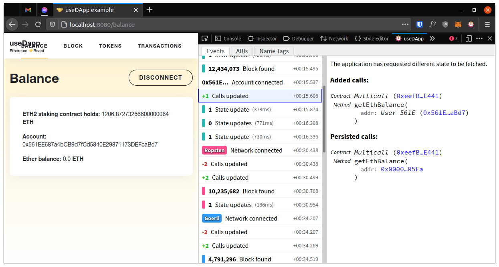
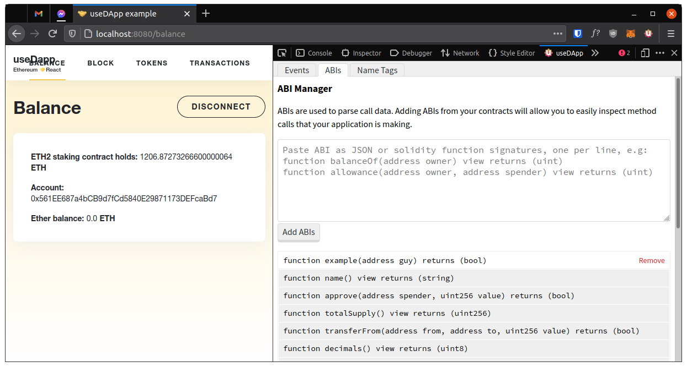
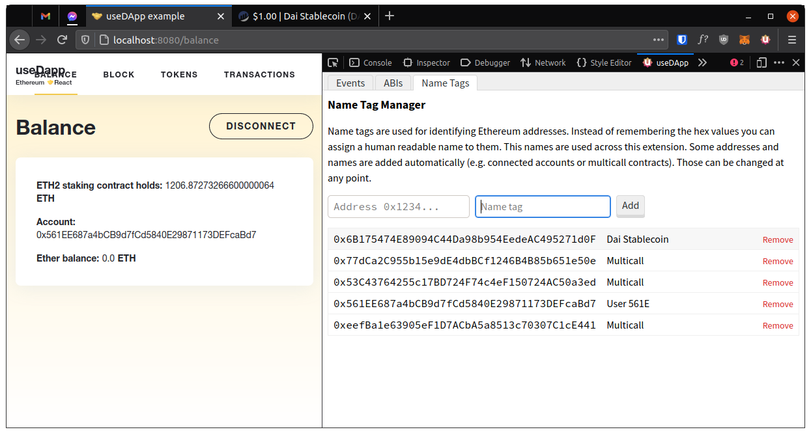

# useDApp DevTools





## Features

1. Look at what is happening in useDapp under the hood
2. Explore calls that are parsed into human readable form
3. Add custom ABIs
4. Add custom address name tags

## Installing the extension (before it is released through stores)

First build the source code:

1. Clone the repository
2. `yarn` - install dependencies
3. `cd packages/extension` - navigate to the extension folder
4. `yarn build` - build the source

Firefox:

1. Go to `about:debugging#/runtime/this-firefox`
2. Click `Temporary Extensions` > `Load Temporary Add-on`
3. Open `packages/extension/build/manifest.json`

Chrome:

1. Go to `chrome://extensions/`
2. Toggle `Developer mode`
3. Click `Load unpacked`
4. Open `packages/extension/build`

## Developing the extension

Because getting the extension in the correct state for development can be hard the recommended way to develop the UI is through Storybook. To open the app in storybook run `yarn storybook`. You will be presented with a view of stories. Each story presents a component in a unique and interactive way. This means that you can create a story that represents a traditionally hard to reach UI state and develop that state easily.

To create new stories create a `.stories.tsx` file in the source code. This file is development only and won't be included in the production bundle. To learn more about how to write stories read the Storybook documentation.

## Extension technical details

The extension is a regular React application that can communicate with the useDApp framework. Because of how browser extensions work this communication is not exactly straightforward.

Below is an overview of the scripts involved in communication:

```
@usedapp/core (via src/providers/devtools.ts)
    ⇅
__USEDAPP_DEVTOOLS_HOOK__ ← static/scripts/devtools.js
    ⇅
static/scripts/content.js
    ⇅
static/scripts/background.js
    ⇅
src/connect.ts
```

Let's start by exploring `content.js`. This is a content script, which means it runs for every tab in the browser. This script has three responsibilities.

1. Inject `__USEDAPP_DEVTOOLS_HOOK__` into the page. The content script runs in isolation and it cannot call or be called by the page. This is why another script is injected. This script creates the global variable that can be used to communicate with the content script via message passing.
2. Forward messages from the page to `background.js`. The content script cannot communicate directly with the devtools so it uses the background script as an intermediary. It opens a port (connection) to the runtime (background script) and communicates with it via message passing.
3. Remember messages so that they can be replayed. Whenever devtools are opened the devtools page is recreated, meaning that it forgets its previous state. The content script remembers messages that it sent so that when devtools ask it can replay them. In this way, devtools can show data that was generated before they were opened.

Moving on to the `__USEDAPP_DEVTOOLS_HOOK__`. It is an object with four properties:

- `useDApp` - boolean value indicating whether useDApp is used on the page
- `init()` - function that is called by the useDApp framework. It sets the `useDApp` property to `true` as well as sends a special message to `background.js` (through `content.js`) that changes the extension icon to a colorful one and updates the popup to say that useDApp was detected
- `send(message)` - sends a message to devtools through `content.js` and `background.js`. Every message is timestamped.
- `listen(cb)` - adds a listener to messages coming from devtools. Returns an unsubscribe callback

At this point we can take a look at `devtools.js`. This script is run every time the devtools window is opened. The purpose of this script is to create the devtools panel if useDApp is present on the page. In order to detect useDApp it polls the `__USEDAPP_DEVTOOLS_HOOK__.useDApp` property. When the value becomes `true` the panel is created. This script does not communicate with any other part of the extension in any way.

The panel is created with the `static/index.html` document. This document requires the `scripts/panel.bundle.js` script which is bundled using webpack. Source of this script lives in the `src` directory. In `src/connect.ts` the panel establishes communication with the page by opening a port (connection) to the runtime (`background.js`), similarly to the content script.

With this we can finally take a look at `background.js`. A single instance of this script runs constantly in the browser's background. It has two tasks:

1. It receives connections from many content scripts as well as many devtools panels. It matches them by the browser tab they came from and forwards messages back and forth.
2. It receives the init call send from `__USEDAPP_DEVTOOLS_HOOK__` through `content.js`. It updates the extension icon and popup for that tab.
